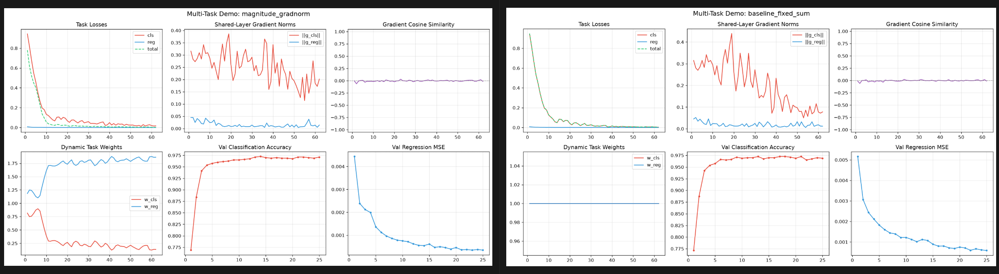

# 多任务学习

参考如下知乎文档：[https://www.zhihu.com/question/375794498/answer/2019747802536781346](https://www.zhihu.com/question/375794498/answer/2019747802536781346?share_code=SaaVqdegiuTz&utm_psn=2050871830479631294)

Cursor开发程序并验证：[https://github.com/ZhangPHEngr/multi_task_dl](https://github.com/ZhangPHEngr/multi_task_dl)

| **方法** | **平衡维度** | **核心原理** | **论文 / 出处** |
| --- | --- | --- | --- |
| 手改固定权重 | 无 | 经验调参确定各loss权重 | — |
| **GradNorm** | 幅值平衡 | 可学习任务权重 w，使共享层上各任务的加权梯度范按学习难度分配；学得慢的困难任务权重大 | *GradNorm: Gradient Normalization for Adaptive Loss Balancing* (ICML 2018) |
| **Uncertainty Weighting (UW)** | 幅值平衡 | 每个任务学一个噪声/不确定性 σi；不确定性大的任务自动降权 | *Multi-Task Learning Using Uncertainty to Weigh Losses* (CVPR 2018) |
| **DWA** (Dynamic Weight Average) | 速度平衡 | 按 **epoch** 比较各任务损失下降快慢：下降慢的任务下一轮权重大 | *End-to-End Multi-Task Learning with Attention* (CVPR 2019) |
| **PCGrad** | 方向平衡 | 两任务梯度冲突（点积 < 0）时，将其中一个投影到另一个的法平面，去掉对抗分量后再合并 | *Gradient Surgery for Multi-Task Learning* (NeurIPS 2020) |
| 分阶段训练 | **结构解耦** | 先单任务建表示，再训另一任务头，最后低 lr 联合微调；用冻结减少任务间干扰 | 课程学习思想（无单一论文） |
|  |  |  |  |

# 1.**GradNorm**

参考：[https://zhuanlan.zhihu.com/p/399214024](https://zhuanlan.zhihu.com/p/399214024)

算法步骤：

- 初始化权重调整网络 $N_{weight}$
- 记录主网络首次推理获取多任务Loss $L_{i}(0)$   $i$ 表示多个任务index, 0表示首次前向推理
- 多iter训练过程中：
    - 获取主网络推理多任务Loss $L_{i}(t)$ 和 针对不同任务加权后共享权重层的梯度2范数 $G_{i}(t)$
    - 计算Loss衰减比 $\begin{matrix}r_i(t)=\tilde{L}_i(t)/E_\mathrm{task}{[\tilde{L}_i(t)]}  & \tilde{L}_i(t)=L_i(t)/L_i(0)\end{matrix}$  衰减比越大，说明loss下降越快，说明任务越好学
    - 计算平均梯度范数 $\bar{G} (t) = E_\mathrm{task}{[{G}_i(t)]}$
    - 计算权重调整网络Loss并反传 $L_{weight} = \sum_i \left\| G_{i}(t) - \bar{G}_i(t) \times \big[r_i(t)\big]^\alpha \right\|$  使得共享层梯度对于难的任务作用越大，对于简单的任务作用越小， $\alpha$ 要针对任务间复杂程度调整越复杂越大

实验结果：

GradNorm中loss收敛更快，且难的reg任务权重逐渐增加

# 2.**Uncertainty Weighting**

算法原理：

- 增加多个可学习参数v，表示每个任务学习的困难程度，也可以说是方差
- 在主网络loss回传时学习该参数

$$
L_{new} =\sum_{i}^{}  e^{-v_{i}}L_{i}+v_{i}
$$

3.DWA(**Dynamic Weight Average**)

算法介绍：

实验结果：

# 4.PCGrad

算法介绍：

[https://zhuanlan.zhihu.com/p/158507261](https://zhuanlan.zhihu.com/p/158507261)

实验结论：

# 5.分阶段训练

实验结论：

